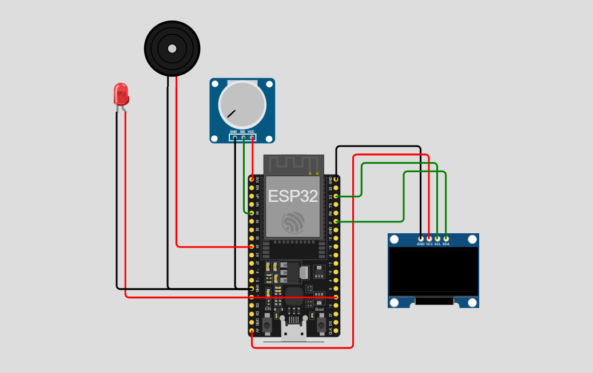

# **Lembrete de Remédios**

Este repositório implementa um sistema de **lembrete de medicamentos**, utilizando um ESP32, display OLED, potenciômetro, buzzer e LED. O horário do alarme é configurado através do potenciômetro, e a comunicação ocorre via protocolo MQTT, com sincronização de horário via NTP.

---

## 📷 Protótipo

> *Simulação feita no [Wokwi](https://wokwi.com/).*



---

## 🔧 Componentes Utilizados

* **Placa:** ESP32 DevKit C v4 (simulado no Wokwi)
* **Display:** OLED monocromático I2C
* **Entrada:** Potenciômetro (configuração do horário)
* **Atuadores:** 1× LED de alerta, 1× buzzer piezoelétrico
* **Comunicação:** Wi-Fi + MQTT via `test.mosquitto.org:1883` + NTP para sincronização de horário

---

## ⚙️ Como Funciona

1. **Configuração do Horário**
   O potenciômetro permite ajustar o horário do alarme de 00:00 a 23:59.

2. **Sincronização de Horário**
   O ESP32 se conecta a um servidor NTP para obter o horário atual (fuso GMT-3).

3. **Monitoramento**
   O sistema compara continuamente o horário atual com o horário configurado no potenciômetro.

4. **Alerta**

   * Quando o horário atual coincide com o horário configurado:
     * O **LED acende**
     * O **buzzer emite som intermitente** (500ms de intervalo)
     * O **display mostra mensagem de alerta**

5. **Exibição local**
   O display OLED mostra em tempo real:
   * Horário atual
   * Próximo horário do medicamento
   * Mensagem de alerta quando chegar a hora

6. **MQTT**

   * Publicação em tópicos:
     * `medicamento/hora` (horário configurado no formato HH:MM)
     * `medicamento/alerta` (mensagem "HORA DO MEDICAMENTO!!" quando dispara)
   * Broker: `test.mosquitto.org` porta `1883` via TCP/IP
   * Cliente MQTT: PubSubClient para ESP32

---

## 📁 Estrutura de Arquivos

```plaintext
├── sketch.ino       # Código principal do projeto
├── diagram.json     # Diagrama do circuito no Wokwi
└── libraries.txt    # Bibliotecas necessárias
```

---

## 🚀 Simulação no Wokwi

1. Acesse [https://wokwi.com](https://wokwi.com)
2. Crie um novo projeto e faça upload de:

   * `sketch.ino`
   * `diagram.json`
   * `libraries.txt`
3. Clique em **Start Simulation**
4. Abra o **Serial Monitor** e observe o **display OLED** na tela
5. Ajuste o **potenciômetro** para configurar o horário do alarme

---

## Interfaces e Protocolos

Este projeto utiliza comunicação via protocolo **MQTT** (Message Queuing Telemetry Transport) e sincronização de horário via **NTP** (Network Time Protocol), com os seguintes detalhes:

* **Broker MQTT:** `test.mosquitto.org`
* **Porta:** `1883`
* **Transporte:** TCP/IP
* **Client Library:** PubSubClient para ESP32
* **Servidor NTP:** `pool.ntp.org` (GMT-3)

### Publicações (ESP32 → Broker)

| Tópico                | Descrição                                         |
| --------------------- | ------------------------------------------------- |
| `medicamento/hora`    | Horário configurado para o medicamento (HH:MM)    |
| `medicamento/alerta`  | Mensagem de alerta quando o horário é atingido    |

---

## 🔄 Possíveis Extensões

* Configuração remota do horário via MQTT
* Múltiplos horários de medicamentos programáveis
* Histórico de alertas disparados
* Botão de confirmação de tomada do medicamento
* Integração com dashboard Node-RED para visualização

---

## 📜 Licença

Este projeto está licenciado sob a MIT License. Veja o arquivo `LICENSE` para mais detalhes.
